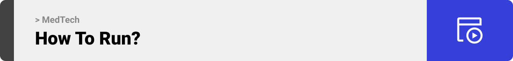

<br><br>

<!-- project philosophy -->


> A system that transfers the medical feild to another level
>
> Medtech aims to transform hospital management systems by implementing AI-driven solutions, including a robot-assisted ER diagnosis system and AI-based scheduling tools created to enhance hospitals' efficiency.

### User Stories

- As a doctor, I want to log in to my account so I can see my schedule and tasks
- As a doctor working in the ER, I want an AI-powered robot that assists me in diagnosing and starting the treatment process by sending me a report immediately to approve so the patients don’t wait when the ER gets crowded.

- As an admin, I want a scheduling system to request and schedule meetings efficiently taking into consideration the staff availability and hospital needs. So the meeting can be scheduled at the perfect time.

<br><br>

<!-- Prototyping -->


> I designed MedTech using wireframes and mockups, iterating on the design until we reached the ideal layout for easy navigation and a seamless user experience.

### Mockups

| Login Screen                        | Schedule Screen                     | Report Screen                                         |
| ----------------------------------- | ------------------------------------ | ----------------------------------------------------- |
|  |  |  |

<br><br>

<!-- Implementation -->


> Using the wireframes and mockups as a guide, I implemented Medtech with the following features:

### User Screens

| Login screen                             | Patients Screen                           | Reports Screen                           |
| ---------------------------------------- | ----------------------------------------- | ---------------------------------------- |
|  |  |  |

| Single Report Screen                               | Single Report Screen                                 | Schedule Screen                              |
| -------------------------------------------------- | ---------------------------------------------------- | -------------------------------------------- |
|  |  |  |

### Admin Screens (Web)

| Dashboard screen                          | Employees screen                            | Employee Profile screen                              |
| ----------------------------------------- | ------------------------------------------- | ---------------------------------------------------- |
|  |  |  |

<br><br>

<!-- Tech stack -->


### MedTech is built using the following technologies:

- React is a popular JavaScript library for building user interfaces. You used it to create the frontend of my application, providing a responsive and interactive user experience
- Laravel is a powerful PHP framework for developing web applications. It was used to build the backend of my project, handling tasks like user authentication, database interactions, and API endpoints.
- MySQL is a widely-used open-source relational database management system. In my project, it stored and managed hospital data, ensuring data integrity and efficient retrieval.
- TensorFlow is an open-source machine learning framework developed by Google. I leveraged TensorFlow for image detection, allowing my application to analyze and interpret images, potentially for medical diagnostics or other purposes.
- Arduino is a hardware and software platform for building electronic projects. You used Arduino to create a robot that scans images of patients. This integration of hardware and software enabled automated image capture and potentially improved the efficiency of patient data acquisition.
- Utilized Firebase Cloud Messaging (FCM) for real-time push notifications, enhancing user engagement and timely updates in the healthcare application.

<br><br>

<!-- How to run -->


> To set up MedTech locally, follow these steps:

### Prerequisites

This is an example of how to list things you need to use the software and how to install them.

- npm
  ```sh
  npm install npm@latest -g
  ```
- Install back-end packages
  ```sh
  composer install.
  ```
- Insert your Open AI key in .env file
- Copy this into Arduino IDE prefrences -> Additional boards manager URLs
  ```sh
  https://github.com/me-no-dev/ESPAsyncWebServer/blob/f71e3d427b5be9791a8a2c93cf8079792c3a9a26/library.json,https://raw.githubusercontent.com/espressif/arduino-esp32/gh-pages/package_esp32_index.json
  ```
- Upload Arduino files to boards

Now, you should be able to run Coffee Express locally and explore its features.
