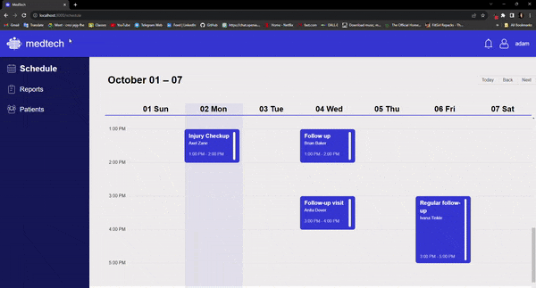

<br><br>

<!-- Table of Content-->


<br><br>

- [Project Philosophy](#philosophy)
- [User Stories](#user-stories)
- [Prototyping](#mockups)
- [Demo](#demo)
  - [User Screens](#user-screens)
  - [Admin Screens](#admin-screens)
- [Tech Stack](#stacks)
- [OpenAi](#opneai)
- [OpenAi](#arduino)
- [How to Run](#how-to-run)
  - [Prerequisites](#prerequisites)
  - [Installation](#installation)

<br><br>

<!-- project philosophy -->

<a name="philosophy"></a>


> A system that transfers the medical feild to another level
>
> Medtech aims to transform hospital management systems by implementing AI-driven solutions, including a robot-assisted ER diagnosis system and AI-based scheduling tools created to enhance hospitals' efficiency.

### User Stories

- As a receptionist in a hospital, I would like to add patients coming into the system database, so the AI Doctor knows where he is needed to diagnose patients

- As a doctor, I want to log in to my account so I can see my schedule and tasks
- As a doctor working in the ER, I want an AI-powered robot that assists me in diagnosing and starting the treatment process by sending me a report immediately to approve so the patients don’t wait when the ER gets crowded.

- As an admin, I want a scheduling system to request and schedule meetings efficiently taking into consideration the staff availability and hospital needs. So the meeting can be scheduled at the perfect time.
- As an admin, I want to receive up-to-date statistics about the hospital, allowing me to make informed decisions and track the hospital's performance.

<br><br>

<!-- Prototyping -->

<a name="prototyping"></a>


> I designed MedTech using wireframes and mockups, iterating on the design until we reached the ideal layout for easy navigation and a seamless user experience.

### Mockups

| Login Screen                        | Schedule Screen                      | Report Screen                                         |
| ----------------------------------- | ------------------------------------ | ----------------------------------------------------- |
|  |  |  |

<br><br>

<!-- Implementation -->

<a name="demo"></a>


> Using the wireframes and mockups as a guide, I implemented Medtech with the following features:

### Admin Screens

| Dashboard screen                          | Employee profile screen                              |
| ----------------------------------------- | ---------------------------------------------------- |
|  |  |

| Add employee screen                            | Employee profile screen                     |
| ---------------------------------------------- | ------------------------------------------- |
|  |  |

### User Screens

| Login screen                             | Patients Screen                           |
| ---------------------------------------- | ----------------------------------------- |
|  |  |

| Single Report Screen                             | Reports Screen                           |
| ------------------------------------------------ | ---------------------------------------- |
|  |  |

| Single Report Screen                      | Schedule Screen                               |
| ----------------------------------------- | --------------------------------------------- |
|  |  |

<br><br>

<!-- Tech stack -->

<a name="stacks"></a>


### MedTech is built using the following technologies:

- [React](https://react.dev/) is a popular JavaScript library for building user interfaces. I used it to create the frontend of my application, providing a responsive and interactive user experience
- [Laravel](https://laravel.com/) is a powerful PHP framework for developing web applications. It was used to build the backend of my project, handling tasks like user authentication, database interactions, and API endpoints.
- [MySQL](https://www.mysql.com/) is a widely-used open-source relational database management system. In my project, it stored and managed hospital data, ensuring data integrity and efficient retrieval.
- [TensorFlow](https://www.tensorflow.org/) is an open-source machine learning framework developed by Google. I leveraged TensorFlow for image detection, allowing my application to analyze and interpret images, potentially for medical diagnostics or other purposes.
- [Arduino](https://www.arduino.cc/) is a hardware and software platform for building electronic projects. I used Arduino to create a robot that scans images of patients. This integration of hardware and software enabled automated image capture and potentially improved the efficiency of patient data acquisition.
- Utilized [Firebase](https://firebase.google.com/) Cloud Messaging (FCM) for real-time push notifications, enhancing user engagement and timely updates in the healthcare application.

<br><br>

<a name="opneai"></a>


> Here is an example of the outcome of my OpenAi API

```Json
{
    "medications": [
        {
            "name": "Hydrocortisone Cream",
            "dosage": "0.5g",
            "purpose": "Treat skin tears",
            "frequency": "4 times a day"
        }
    ],
    "scans": [
        {
            "name": "CT Scan",
            "date": "25/10/2023"
        }
    ],
    "blood_tests": [
        {
            "name": "CBC",
            "date": "29/09/2023"
        }
    ],
    "appointments": [
        {
            "doctor_id": 1,
            "reason": "Follow Up on Treatment",
            "start": "30/09/2023 15:00",
            "end": "30/09/2023 16:00"
        }
    ]
}

```

<a name="arduino"></a>


> Here is the circuit of the Arduino:

| Circuit                                       |
| --------------------------------------------- |
|  |

<br><br>

<!-- How to run -->


> To set up MedTech locally, follow these steps:

### Prerequisites

- Arduino IDE: You'll need the Arduino IDE to upload code to the Arduino board and ESP8266 microchip.

- Arduino Uno: The main control board for the car and paths.

- ESP8266 (Hardware): Used for wireless communication between the system and the arduino.

- OV7670 (Hardware): A camera module for capturing pictures of the patients.

### Installation

This is an example of how to list things you need to use the software and how to install them.

- npm
  ```sh
  npm install npm@latest -g
  ```
- Install back-end packages
  ```sh
  composer install.
  ```
- Insert your Open AI key in .env file
- Copy this into Arduino IDE prefrences -> Additional boards manager URLs
  ```sh
  https://github.com/me-no-dev/ESPAsyncWebServer/blob/f71e3d427b5be9791a8a2c93cf8079792c3a9a26/library.json,https://raw.githubusercontent.com/espressif/arduino-esp32/gh-pages/package_esp32_index.json
  ```
- From the Boards manager you should be able to download esp32 board to upload the code to it

- Upload Arduino files to boards

Now, you should be able to run MedTech locally and explore its features.
